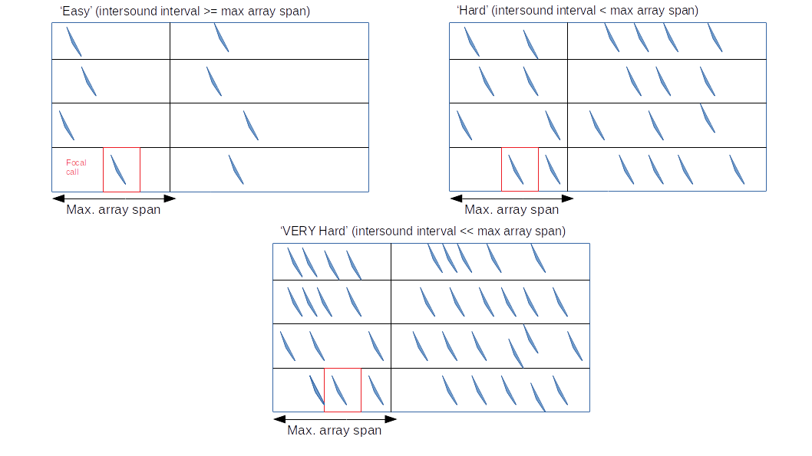

Correspondence matching (Detailed)
==================================

Identifying each candidate signal: final outputs
------------------------------------------------
Each candidate signal can be identified uniquely in a file by it's channel number, and its index position within the channel. 
(`Remember, in Python indexing starts with 0`). So, for instance, let's take this example candidate signal array:

.. code-block:: python

    [ [(0.1,0.3),   (0.5,0.8),   (0.9,1.2)],
      [(0.15,0.35), (0.23, 0.45)          ],
      [(0.2,0.9),   (.9,1.2),  (1.23,1.26)],
      [(0.1,0.7),   (1.,1.1),  (1.29,1.38)]  
    ]

Each candidate signal in the array above will have the following identities:

.. code-block:: python

    [ [ (0,0),   (0,1),   (0,2) ],
      [ (1,0),   (1,1)          ],
      [ (2,0),   (2,1),   (2,2) ],
      [ (3,0),   (3,1),    (3,2) ]  
    ]

The final outputs will be a 'set' of calls which have been matched, the set name is based on the ID of the call in the reference channel (`this may/not be a good idea...what if the ref. channel doesn't have good detections or the detection quality changes over time..`).

.. code-block:: python 

    matched_sounds = {(3,0):set([(0,0), (1,0), (2,0)]),
                      (3,1):set([(0,1), (1,1), (2,1)]),
                      (3,2):set([(0,2),       (2,2)])
                     }

Not all detections will necessarily be matched with another detection in all channels. Sometimes, this might be due to failure  of the matching algorithm and sometimes it might be due to the directionality  of the source sound. In the example above the sound :code:`(3,1)` doesn't have a match on channel 2, and this means that particular sound can't be localised even though it has been detected.

Technical details and open questions
------------------------------------
The 

Important variables
-------------------

#. Maximum distance from reference mic to other mics
#. Inter-sound interval
#. Sound duration 

Scenarios to handle
-------------------
The most important thing to check is if correspondence matching based on the 
max array distance works. It `will` work when there are few sounds, and these sounds are spaced far apart in time.

Easy case: when all signals are detected well
~~~~~~~~~~~~~~~~~~~~~~~~~~~~~~~~~~~~~~~~~~~~~
Then it's mostly just a question of matching the first sounds across all channels, and then the second, and so on till all `N` sounds have been matched. 
Though, even here - there can be issues if there is even a single call that's not been detected. The better way to do it would be to compare the inter-mic distance to 
estimate the maximum delay possible betweeen two mics. 

Not so  easy cases: high 'signal density'
~~~~~~~~~~~~~~~~~~~~~~~~~~~~~~~~~~~~~~~~~~~~~~~~~~~~~~~~~~~~~~~~~~~~~~~~~~~~~~~~~~~
What happens when the inter-sound interval drops below that of the max-array distance, 
and which rules work better then?

Not so  easy cases: high signal density and similar sounds
~~~~~~~~~~~~~~~~~~~~~~~~~~~~~~~~~~~~~~~~~~~~~~~~~~~~~~~~~~
Aside from the inter-sound arrival, there's also the question of signal similarity.
How to deal with the case where the sounds are 

#. Unique --> this is the 'easy' case, as any given image-base algorithm should be able to match the sounds correctly
#. (Effectively) the same --> this is the 'tough' case, where algorithms may have a tough time. 

Poor/Missed detections?
~~~~~~~~~~~~~~~~~~~~~~~

Possible solutions 
------------------

#. Spectrogram cross-correlation?

#. Stereo image matching : Try and use established algorithms from image analysis/ structure-from-motion/etc. to generate matches across the different calls and channels using spectrogram representations. One of the issues is that these matching algorithms are built with rotational invariance in mind  -- which might mess things up.

