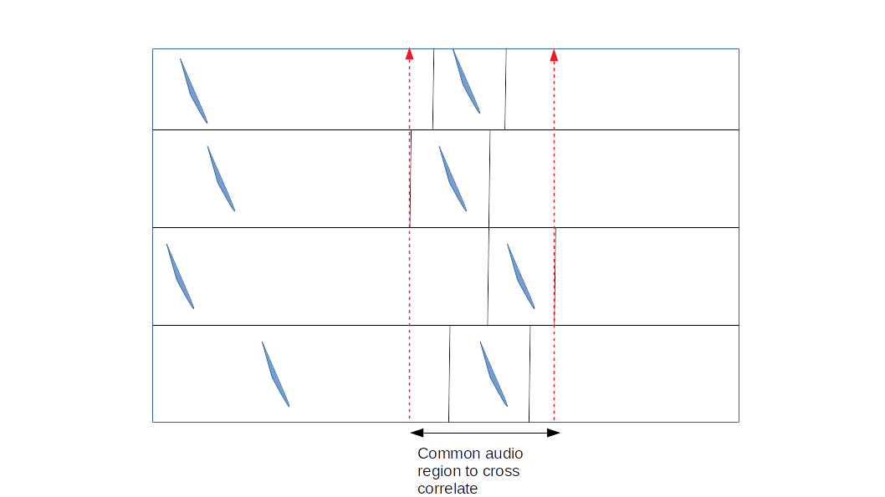

TDOA Estimation (Detailed)
==========================
To localise sound using a spherical/hyperbolic formulation, the range diffferences are required to the source.
The range differencees are calculated by measuring the time difference of arrival (TDOA) x speed of sound. 

Selecting audio samples for TDOA estimation
-------------------------------------------
The correspondence matching output will be in the form of start and stop times of each call, along with the unique 
cross-channel matched id assigned to a call. To estimate the TDOA's, a common set of samples need to be cross correlated.
The common set of samples will need to be assigned based on the earliest and latest detected sounds. In the easy case:

Estimating TDOAs when there are overlaps: some ideas
----------------------------------------------------
It is pretty likely that there will be overlaps across channels when there are multiple animals vocalising together. How to handle these situations. 
While it is close to impossible to handle complete overlap, there is probably some sense in trying to use signals that are only partially overlapped. 

#. The easy way out: One possibility to avoid overlapping signals completely, and only use those microphone channels where no signals overlap.

#. The somewhat tough ways out: If there is no way to avoid the overlap, then there are a couple of ways to handle such situations 

    #. Bandpass filter signals in the spectral region of least temporal overlap: It's best visualised when you have two FM bat calls overlapping. The end parts of the 
    calls may be overlapping, but the higher frequencies are not. By high-pass filtering at the region of least overlap - a better TDOA measurement and call assignment
    can take place. 

